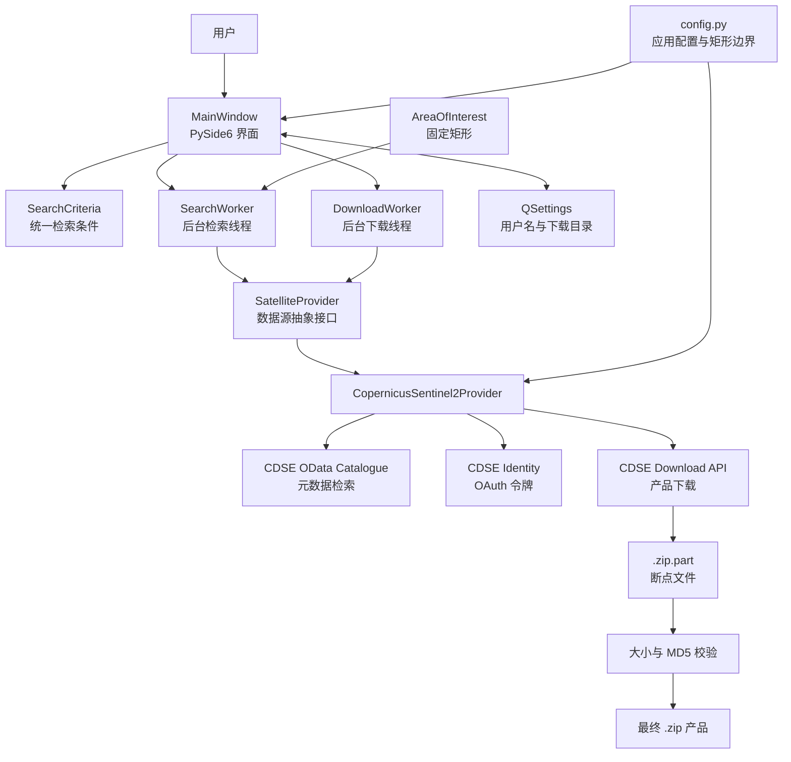
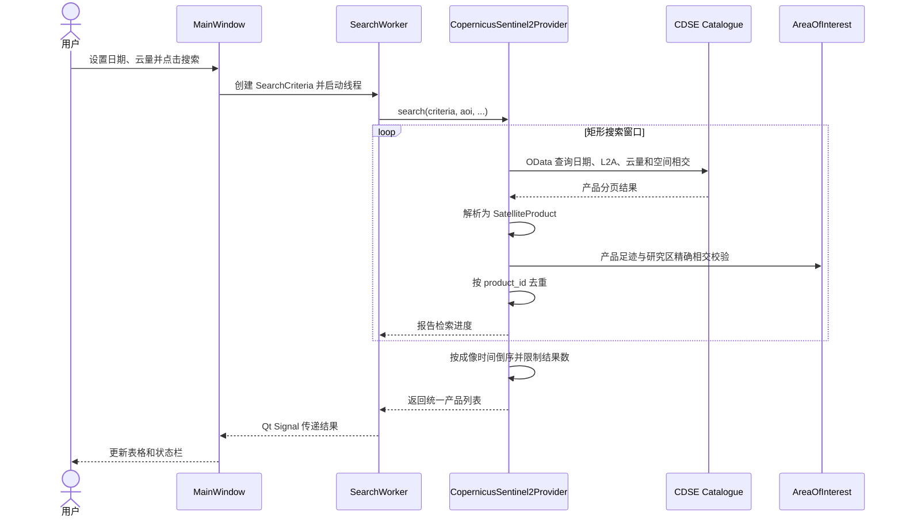
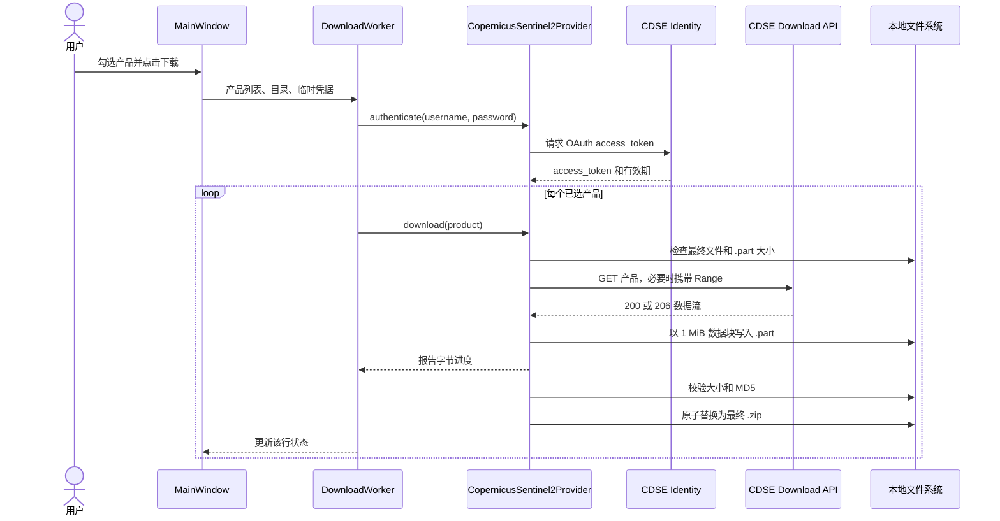
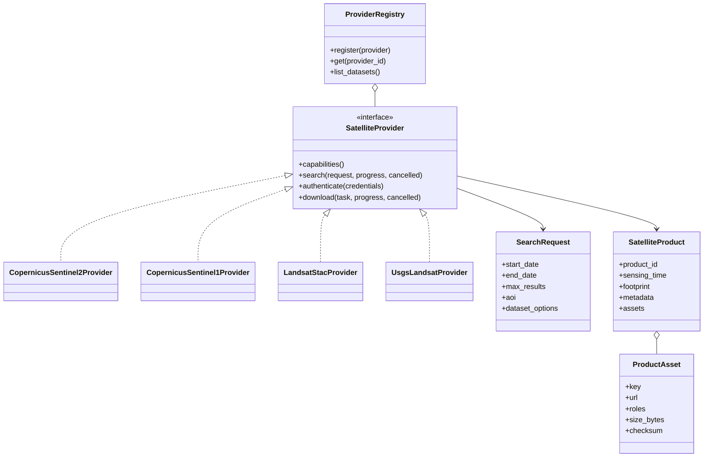

# 卫星影像下载器：系统设计与扩展指南

## 1. 文档目的

本文档描述卫星影像下载器当前已经实现的功能、代码架构和关键流程，
并给出扩展到 Sentinel-1、Landsat 8/9 等数据源时的设计建议。

当前版本是一个面向固定研究区的桌面工具，不是通用遥感数据门户。它优先解决：

1. 只检索固定矩形范围内的 Sentinel-2 L2A 影像；
2. 快速查看产品时间、云量、大小等元数据；
3. 可靠下载完整产品，支持断点续传和校验；
4. 保持数据源层可替换，为后续增加其他卫星留出接口。

## 2. 当前系统边界

### 2.1 已支持

| 能力 | 当前实现 |
| --- | --- |
| 操作系统 | Windows 桌面程序 |
| 用户界面 | PySide6 |
| 研究区 | 程序配置中的固定矩形 |
| 研究区文件 | 不依赖外部矢量文件 |
| 卫星/产品 | Sentinel-2 L2A |
| 数据目录 | Copernicus Data Space Ecosystem（CDSE）OData API |
| 检索条件 | 开始日期、结束日期、最大云量、最大结果数 |
| 空间约束 | 服务端按矩形搜索窗口过滤，本地再与研究区几何相交校验 |
| 认证 | CDSE 用户名和密码换取 OAuth 访问令牌 |
| 下载 | 完整 L2A `.SAFE` 产品压缩包 |
| 下载可靠性 | `.part` 断点续传、HTTP 重试、逐景失败隔离、MD5 校验 |
| 本地设置 | 保存用户名和下载目录，不保存密码 |
| 后台执行 | 搜索和下载均在 Qt 工作线程中运行 |

一次搜索会返回日期范围内与固定矩形相交的多个瓦片和多次过境产品。

### 2.2 当前未支持

- 地图选区和动态研究区编辑；
- Sentinel-1、Landsat 等其他卫星；
- 自动判断同一次过境对固定矩形的覆盖是否完整；
- 按波段下载、云优化 GeoTIFF（COG）下载；
- 下载后自动解压、裁剪、拼接、重投影或云掩膜；
- 下载历史数据库和任务恢复数据库；
- 代理配置、限速和计划任务；
- 可独立分发的 Windows 安装包。

## 3. 用户工作流

1. 启动程序，固定矩形研究区由程序自动加载；
2. 设置日期范围、最大云量和最大结果数；
3. 点击“搜索”，查看符合条件的 Sentinel-2 L2A 产品；
4. 勾选需要的产品并设置保存目录；
5. 输入 CDSE 账号和密码；
6. 点击“下载所选”；
7. 程序逐景下载，失败时保留 `.part` 文件，下次可继续。

程序入口：

```powershell
D:\Acode\anaconda\envs\anshuIndex\python.exe run.py
```

## 4. 当前总体架构



架构采用四层职责划分：

| 层次 | 主要模块 | 职责 |
| --- | --- | --- |
| 表示层 | `ui/main_window.py` | 收集参数、展示结果、管理按钮和进度状态 |
| 后台任务层 | `workers.py` | 将阻塞式网络与文件操作移出 GUI 主线程 |
| 领域与服务层 | `models.py`、`aoi.py` | 统一产品模型、检索条件和研究区几何 |
| 数据源层 | `providers/` | 将外部目录、认证和下载协议适配为统一接口 |

## 5. 代码组织

```text
satelliteImageDownload/
├── docs/
│   └── system-design.md
├── src/satellite_downloader/
│   ├── app.py                  # QApplication 和依赖装配
│   ├── config.py               # 路径、应用名和固定矩形边界
│   ├── models.py               # SearchCriteria、SatelliteProduct
│   ├── aoi.py                  # 研究区构造、校验和空间窗口
│   ├── exceptions.py           # 面向用户的异常类型
│   ├── workers.py              # 搜索与下载后台任务
│   ├── providers/
│   │   ├── base.py             # SatelliteProvider 抽象接口
│   │   └── copernicus.py       # Sentinel-2/CDSE 实现
│   └── ui/
│       └── main_window.py      # 主窗口
├── tests/                      # 研究区、模型和 provider 测试
├── pyproject.toml              # 项目元数据与依赖
├── README.md                   # 快速运行说明
└── run.py                      # 源码运行入口
```

### 5.1 统一产品模型

`SatelliteProduct` 是界面与具体卫星数据源之间的边界。当前统一字段包括：

- 数据源标识和产品 ID；
- 产品名称和成像时间；
- 云量、瓦片号、文件大小和在线状态；
- 产品足迹；
- MD5 校验值；
- 数据源特有的 `metadata`。

界面只使用这些统一字段，不直接解析 CDSE JSON。未来 provider 应负责把各平台
返回的字段转换成 `SatelliteProduct`。

### 5.2 Provider 接口

`SatelliteProvider` 当前定义三个核心操作：

```python
search(criteria, aoi, search_boxes, progress, cancelled)
authenticate(username, password)
download(product, destination, progress, cancelled)
```

这使检索、认证和下载协议都封装在 provider 内部。界面和工作线程无需知道
OData、STAC、USGS M2M 或对象存储 URL 的细节。

## 6. Sentinel-2 检索流程



当前使用 `AreaOfInterest.search_boxes()` 将固定矩形切分为较短的 OData 空间查询，
避免请求 URL 过长。目录结果返回后，Provider 再与矩形几何做精确相交校验和去重。

## 7. 下载与认证流程



关键可靠性设计：

- 网络请求对 `429` 和常见 `5xx` 状态进行有限重试和退避；
- 下载重定向由程序显式处理，避免跨域时丢失认证头；
- 服务器支持 Range 时从 `.part` 当前长度继续；
- 服务器忽略 Range 并返回 `200` 时自动重新写入，不错误追加；
- 单景失败不会终止整个下载队列；
- 下载完成后先校验，再将 `.part` 原子改名为最终文件；
- 密码不写入 `QSettings` 或磁盘；provider 会在应用进程内保留凭据，供长下载
  过程中的令牌刷新使用，应用退出后释放。

## 8. 当前设计的限制与近期改进

### 8.1 结果完整性

当前结果按单个产品展示，没有把同一天、同一轨道的多个瓦片组织成一个
“覆盖批次”。建议增加 `AcquisitionGroup`：

- 分组键可由成像日期、相对轨道号和数据处理基线组成；
- 计算产品足迹并集是否覆盖固定矩形；
- 表格可显示覆盖是否完整或缺少的范围；
- 支持一键选择一个完整批次。

这是当前 Sentinel-2 版本最有价值的下一项业务改进。

### 8.2 下载任务持久化

当前 `.part` 文件支持文件级续传，但任务列表只存在于内存。建议增加 SQLite：

- 保存产品 ID、目标路径、已下载字节、状态和错误信息；
- 应用重启后恢复未完成队列；
- 保存检索历史，避免重复请求和重复下载；
- 为后续定期自动下载提供基础。

### 8.3 下载粒度

完整 `.SAFE` 产品通常为数百 MB 到 1 GB 以上。如果研究只使用少量波段，可增加：

- 整包下载；
- 指定波段下载；
- 按研究区裁剪后的 COG 下载或生成；
- RGB、NDVI 等常用输出预设。

这需要把“一个产品对应一个压缩包”的模型扩展为“一个产品包含多个资产”。

### 8.4 工程化

- 增加结构化日志文件，记录请求 ID、重试和下载错误；
- 使用 `keyring` 保存令牌或账号标识，继续避免保存明文密码；
- 增加显式注销接口，在下载队列结束或用户退出登录时清理 provider 内存凭据；
- 增加 PyInstaller 配置和 Windows 安装包；
- 增加 provider 的模拟 HTTP 测试、断点续传测试和大文件校验测试；
- 将 API 地址、超时、重试次数和并发数移到配置对象中。

## 9. 扩展到 Sentinel-1

### 9.1 不能直接复用 Sentinel-2 瓦片逻辑

Sentinel-1 是 SAR 数据，不使用 Sentinel-2 的 MGRS `tileId`。检索空间约束应改为：

1. 使用固定 AOI 或 `AreaOfInterest.search_boxes()` 在服务端做足迹相交查询；
2. 本地对返回足迹进行精确相交过滤；
3. 根据相对轨道、升降轨和 frame 对产品分组；
4. 计算一组产品足迹的并集是否覆盖完整矩形范围。

如果长期使用固定区域，可在首次检索后缓存相关的相对轨道号和 frame，后续用这些
索引缩小查询范围，但不能只凭一次结果永久写死，轨道处理和产品边界可能变化。

### 9.2 建议支持的 Sentinel-1 参数

| 参数 | 建议默认值 | 说明 |
| --- | --- | --- |
| 产品类型 | GRD | 文件较小，适合多数地表监测；SLC 用于干涉处理 |
| 传感器模式 | IW | 陆地区域常用 Interferometric Wide Swath |
| 极化 | VV+VH | 需按实际产品可用性筛选 |
| 轨道方向 | 升轨/降轨/不限 | 不同方向的几何畸变不同 |
| 相对轨道号 | 可选 | 固定区域稳定后可用于加速检索 |
| 成像日期 | 必选 | 与现有公共条件复用 |

### 9.3 可复用与新增模块

可直接复用：

- CDSE OAuth 认证和令牌刷新；
- HTTP Session、重试和重定向处理；
- `.part` 续传、MD5 校验和下载队列；
- `AreaOfInterest`、工作线程和大部分表格行为。

需要新增：

- `CopernicusSentinel1Provider`；
- `Sentinel1SearchOptions`，包含产品类型、模式、极化、轨道方向等；
- 轨道/frame 元数据解析；
- SAR 产品表格列或详情面板；
- 多 frame 联合覆盖完整性计算。

## 10. 扩展到 Landsat 8/9

### 10.1 数据源选择

Landsat 可考虑两条路线：

| 路线 | 优点 | 代价 |
| --- | --- | --- |
| STAC + 公开云存储 | 标准化检索、可直接访问单波段 COG、适合按需下载 | 不同目录的资产命名和签名方式可能不同 |
| USGS M2M/官方整包 | 官方产品与归档完整、适合下载完整场景 | 账号、令牌和接口流程独立于 CDSE |

建议第一版 Landsat provider 优先选择稳定的 STAC 目录，支持 Collection 2 Level-2
及按波段 COG 下载；确有完整官方归档需求时，再增加 USGS M2M provider。

### 10.2 空间索引差异

Landsat 使用 WRS-2 `path/row`，不能复用 Sentinel-2 的 MGRS tileId。固定研究区
可以采用以下过程：

1. 用 AOI 对 WRS-2 网格做一次相交分析，得到目标 path/row；
2. 将 path/row 保存为 Landsat 数据集配置；
3. 检索时服务端按 path/row、日期、平台和云量过滤；
4. 本地继续做足迹相交检查；
5. 对相同成像日期的多个场景做覆盖完整性分组。

### 10.3 产品和下载模型调整

Landsat STAC 产品通常包含多个独立资产，例如：

- 蓝、绿、红、近红外和短波红外波段；
- 地表温度波段；
- `QA_PIXEL`、`QA_RADSAT` 等质量波段；
- 缩略图和元数据文件。

建议增加统一资产模型：

```python
@dataclass(frozen=True)
class ProductAsset:
    key: str
    title: str
    url: str
    size_bytes: int | None
    roles: tuple[str, ...]
    checksum: str | None
```

并让 `SatelliteProduct` 包含 `assets`。下载任务需要支持：

- 下载完整产品；
- 下载用户选择的波段；
- 下载预设波段组；
- 下载后按 AOI 裁剪。

## 11. 建议的目标扩展架构



### 11.1 Provider 能力描述

当前界面固定展示云量和 CDSE 账号。增加不同卫星后，应由 provider 声明能力，例如：

- 是否支持云量；
- 是否需要认证及认证类型；
- 是否支持完整产品、单资产或裁剪下载；
- 可用的专属检索参数；
- 结果表中建议展示的扩展字段。

界面根据能力动态启用参数，而不是不断添加卫星名称判断。

### 11.2 公共条件与专属条件分离

不建议继续向现有 `SearchCriteria` 添加极化、轨道方向、WRS path/row 等所有字段。
推荐拆为：

- `CommonSearchCriteria`：日期、AOI、最大结果数；
- `Sentinel2SearchOptions`：云量、MGRS 瓦片、处理级别；
- `Sentinel1SearchOptions`：模式、极化、产品类型、轨道；
- `LandsatSearchOptions`：平台、Collection、Level、云量、path/row。

这样每个 provider 只接受自己能解释的选项，减少无效字段和条件分支。

## 12. 推荐实施路线


### 阶段 1：完善当前 Sentinel-2

- 增加四瓦片完整批次识别；
- 增加日志和 SQLite 下载历史；
- 增加 Windows 打包；
- 测试令牌刷新、断点续传和磁盘空间不足场景。

### 阶段 2：Sentinel-1 GRD

- 先支持 IW GRD；
- 使用 AOI 足迹检索，不使用 MGRS；
- 增加极化和升降轨过滤；
- 复用 CDSE 认证和整包下载；
- 验证多 frame 对固定矩形的覆盖完整性。

### 阶段 3：Landsat 8/9 Level-2

- 引入 provider registry 和数据集选择；
- 计算并配置固定矩形相关的 WRS-2 path/row；
- 使用 STAC 检索统一元数据；
- 首先实现完整场景或固定波段组下载。

### 阶段 4：资产级下载与预处理

- 增加 `ProductAsset`；
- 支持按波段选择；
- 使用 Rasterio/GDAL 按 AOI 裁剪；
- 输出 COG，并保留处理参数和来源产品 ID；
- 增加 Sentinel-2 云掩膜和 Landsat QA 掩膜。

### 阶段 5：自动化

- 定期检索新增影像；
- 自动判断覆盖批次完整性；
- 自动加入下载和预处理队列；
- 增加磁盘配额、归档策略和任务通知。

## 13. 扩展 Provider 的检查清单

新增卫星或目录时至少确认：

- [ ] 数据目录的服务条款、认证方式和速率限制；
- [ ] 产品 ID、成像时间、足迹、大小、在线状态的字段映射；
- [ ] 空间索引体系是 MGRS、WRS-2、轨道/frame 还是纯足迹；
- [ ] 研究区完整覆盖需要多少产品，以及如何分组；
- [ ] 产品是整包还是多资产；
- [ ] 是否支持 Range 请求和断点续传；
- [ ] 是否提供可信的校验值；
- [ ] 分页、重试、令牌刷新和重定向行为；
- [ ] 对统一模型无法表达的字段如何放入专属 options 或 metadata；
- [ ] 单元测试、模拟 HTTP 测试和至少一次真实目录检索；
- [ ] 不使用真实账号执行自动化测试，不在日志中记录密码或令牌。

## 14. 设计原则总结

1. 固定研究区优先使用卫星原生空间索引缩小服务端查询，再做本地几何校验；
2. 界面只依赖统一模型和 provider 接口，不解析外部平台响应；
3. 公共检索条件与卫星专属条件分离；
4. 检索、认证、下载和预处理保持独立，便于替换数据目录；
5. 大文件操作必须支持取消、重试、断点和校验；
6. 扩展前先定义“完整覆盖”的业务含义，而不只是返回相交产品；
7. 优先完成稳定的数据获取链路，再增加裁剪、拼接和指数计算。
